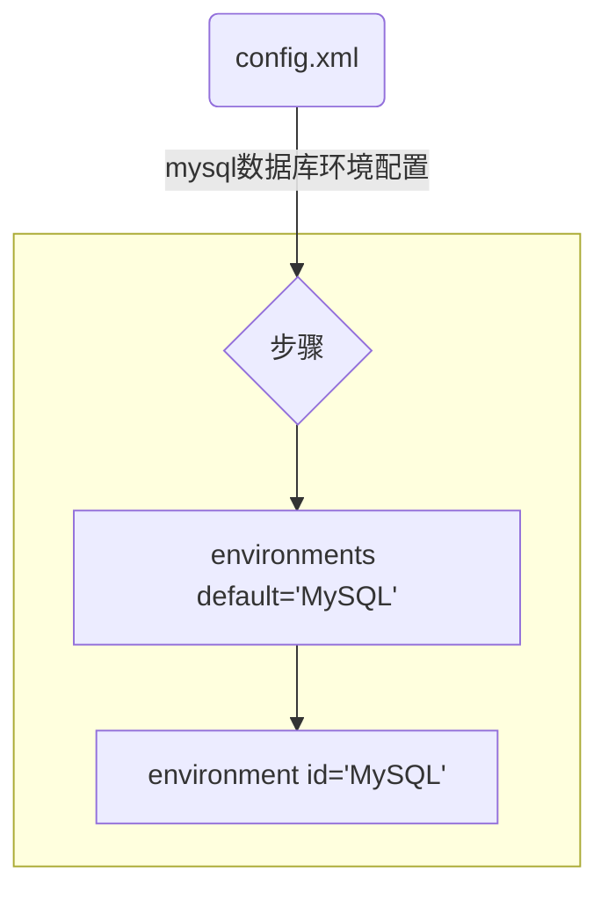

# Spring-04

不用spring来做事务是很麻烦的一件事情  
每次需要用动态代理(即实现接口，生成实现类)或者是用cglib(即继承父类，生成子类)来阻拦方法，从而实现事务  
在采用了Spring之后，AOP使用声明式事务来自动完成事务

>编程式事务

>声明式事务

**************************************

# 整合

<font color = #FF0000 size = 5><b>一、导开发包</b></font>

> 1. spring-jdbc驱动

```
<!--  
https://mvnrepository.com/artifact/org.springframework/spring-jdbc  
-->
<dependency>
<groupId>org.springframework</groupId>
<artifactId>spring-jdbc</artifactId>
<version>5.0.0.RELEASE</version>
</dependency>
```

> 2. 连接池 HikariCP/c3p0  
(两者当中任选一种即可)

``` 
<!-- https://mvnrepository.com/artifact/com.mchange/c3p0 -->
<dependency>
<groupId>com.mchange</groupId>
<artifactId>c3p0</artifactId>
<version>0.9.5.2</version>
</dependency>
```

> 3. log4j-core log4j-api

```
<!-- https://mvnrepository.com/artifact/org.apache.logging.log4j/log4j-core -->
<dependency>
<groupId>org.apache.logging.log4j</groupId>
<artifactId>log4j-core</artifactId>
<version>2.11.1</version>
</dependency>
```

```
<!-- https://mvnrepository.com/artifact/org.apache.logging.log4j/log4j-api -->
<dependency>
<groupId>org.apache.logging.log4j</groupId>
<artifactId>log4j-api</artifactId>
<version>2.11.1</version>
</dependency>
```

> 4. aspectjweaver (织入)

```
<!-- https://mvnrepository.com/artifact/org.aspectj/aspectjweaver -->
<dependency>
<groupId>org.aspectj</groupId>
<artifactId>aspectjweaver</artifactId>
<version>1.8.11</version>
</dependency>
```

> 5. mysql-connector-java

```
<!-- https://mvnrepository.com/artifact/mysql/mysql-connector-java -->
<dependency>
<groupId>mysql</groupId>
<artifactId>mysql-connector-java</artifactId>
<version>5.1.47</version>
</dependency>
```

> 6. spring-mvc

```
<!-- https://mvnrepository.com/artifact/org.springframework/spring-webmvc -->
<dependency>
<groupId>org.springframework</groupId>
<artifactId>spring-webmvc</artifactId>
<version>5.0.0.RELEASE</version>
</dependency>
```

> 7. mybatis

```
<!-- https://mvnrepository.com/artifact/org.mybatis/mybatis -->
<dependency>
<groupId>org.mybatis</groupId>
<artifactId>mybatis</artifactId>
<version>3.4.0</version>
</dependency>
```

> 8. mybatis-spring

```
<!-- https://mvnrepository.com/artifact/org.mybatis/mybatis-spring -->
<dependency>
<groupId>org.mybatis</groupId>
<artifactId>mybatis-spring</artifactId>
<version>1.3.0</version>
</dependency>
```

<font color=#ff0000>
如果使用了mybatisplus，则可以不使用mybatis和mybatis-spring  
mybatisplus当中自带有mybatis和mybatis-spring这两个开发包  

如果使用了mybatisplus，则mybatis和mybatis-spring尽量不适用，避免版本冲突
</font>

> 9. mybatis-plus

```
<!-- https://mvnrepository.com/artifact/com.baomidou/mybatis-plus -->
<dependency>
<groupId>com.baomidou</groupId>
<artifactId>mybatis-plus</artifactId>
<version>3.0.5</version>
</dependency>
```

由于spring各个组件的版本都是一致的，所以当需要更换sping组件版本的时候都需要一个一个的到xml文件当中去改，很是麻烦  
所以可以在xml当中设置变量，以此能够全局改变redis的版本

```
<properties>
<project.build.name>5.0.0.RELEASE</project.build.name>
</properties>

<!-- https://mvnrepository.com/artifact/org.springframework/spring-core -->
<dependency>
<groupId>org.springframework</groupId>
<artifactId>spring-core</artifactId>
<version>${project.build.name}</version>
</dependency>

<!-- https://mvnrepository.com/artifact/org.springframework/spring-context -->
<dependency>
<groupId>org.springframework</groupId>
<artifactId>spring-context</artifactId>
<version>${project.build.name}</version>
</dependency>
```

如果使用了mybatisplus,mybatis开发包和mybatis-spring整合开发包可以不再使用，mybatisplus开发包集成了mybatis开发包以及mybatis-spring整合开发包；同样如果在pom.xml当中复制粘贴了mybatisplus的开发包，即可以使用也可以不使用mybatisplus开发包的功能  
mybatisplus提供了很多的功能，比如乐观锁，分页等功能，mybatisplus都使用了插件，用起来简单了很多，很多的东西都简化了，并且最常用的增删改查也都做了简化，比如说存在有一百张表，每一张如果都需要进行增删改查的话，那么就需要写一百个映射文件以及DAO等，如果是使用了mybatisplus的话，则基本的功能可以不再进行手写了，以后就只需要写比较特殊或者说是复杂的功能就自己写就可以了，至于基本的功能，mybatisplus都已经实现好了  
jdbc驱动使用6.0+版本以上的，则jdbc驱动如果使用字符串存在一些不同的地方，class也有一些不同的地方  

<font color = #FF0000 size = 5><b>二、写类</b></font>

### 生成pojo类  

生成数据库表中与之相对应字段的属性名称  

示例，存在一张名叫作Student的表  
```
int xh 学号  
varchar(20) xm 姓名  
datetime cs 出生  
float money 金钱
```

即在java类当中与之相对应的pojo类(Student类)当中的属性名称即为是
```
private int xh;
private String xm;
private Date cs;
private float money;
//并生成Generate GettersandSetters
```

mybatisplus 当中
如果出现数据库当中的字段名与Java中的pojo类当中的属性名称如果不一样的话，有三种方式可以解决

<font color = #FF0000 size = 3>第一种方式：</font>

```
<sql id="fields">
xh as id,xm,cs,money
</sql>

<select resultType="com.pojo.Student">
select <include ref="fields" /> from student
</select>
```

<font color = #FF0000 size = 3>第二种方式：</font>

```
<resultMap type="com.dao.StudentDAO" id="studentMapper">
<id column="xh" property="id" />
<result column="xm" property="xm" />
<result column="cs" property="cs" />
<result column="money" property="money" />
</resultMap>

<select resultMap="studentMapper">
select xh,xm,cs,money from student
</select>
```

<font color = #FF0000 size = 3>第三种方式：</font>

```
import javax.persistence.Table;

import com.baomidou.mybatisplus.annotation.IdType;
import com.baomidou.mybatisplus.annotation.TableField;
import com.baomidou.mybatisplus.annotation.TableId;

@Table(value="studentService")
public class Student {

@TableId(value="xh",type=IdType.INPUT)
private int id;

@TableField
private String xm;
private Date cs;
private float money;
```

* @TableId用来形容的是主键，即类比于xml映射文件当中的&lt;id column="xh" property="id" />

当数据库当中的表的字段与Java当中的pojo类当中的属性名称一致的话，则可以不使用；如果数据库当中的字段名与java当中的pojo类当中的属性名称不一致的话，就可以使用这种方法  

* @TableId(value="xh",type=IdType.INPUT)小括号当中的  
    value相当于映射文件当中的xh as id  
    type=IdType.INPUT表示的含义是input为自增，默认为是非自增

* mybatisplus中设置的所有的主键字段默认非自增，默认是一个全局的短的uuid；  

    解决方案：第一种是设置一个全局配置的uuid，默认为自增，如果存在有要改写的(小改的)地方就使用
    type=IdType.INPUT即可  

* 如果项目当中存在有100张表，存在有99张表是自增的，其中有一张表是使用了uuid_short()  

    第一种解决方案将99张表当中都设置为type=IdType.INPUT,mybatis设置自增，mybatisplus默认不是自增的，且很多的方法都已经实现好了，当往数据库当中添加一条记录，然而并不知道的是数据库当中，该条记录当中的主键是否自增，因为使用mybatisplus的话，存在一些基本的sql语句是不需要再写的，mybatisplus已经实现好了。  
    第二种解决方式即设置一个全局变量  

* @TableField 用于数据库当中的表中的普通字段  

映射文件config.xml  
如果并不存在student.xml该类映射文件，则该配置文件config.xml也可以不用存在了。

config.xml当中原本的作用即在于配置mysql的环境变量以及导入映射文件student.xml

```
<?xml version="1.0" encoding="UTF-8"?>
<!DOCTYPE configuration PUBLIC "-//mybatis.org//DTD Config 3.0//EN" "mybatis-3-config.dtd">

<configuration>
    <mappers>
       <mapper resource="com/pojo/sql/student.xml"/>
    </mappers>
</configuration>
```



<!-- <!-- - - - - - - 数据库环境配置- - - - - - - - - --
    <environments default="MySQL">
        <environment id="MySQL">
            <transactionManager type="JDBC"/>
            <dataSource type="POOLED">
                <property name="driver" value="com.mysql.jdbc.Driver"/>
                <property name="url" value="jdbc:mysql://127.0.0.1:3306/s6x"/>
                <property name="username" value="root"/>
                <property name="password" value="admin"/>
                
            </dataSource>
        </environment>
    </environments>>
    -->


